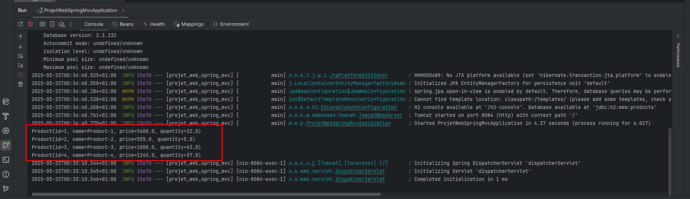
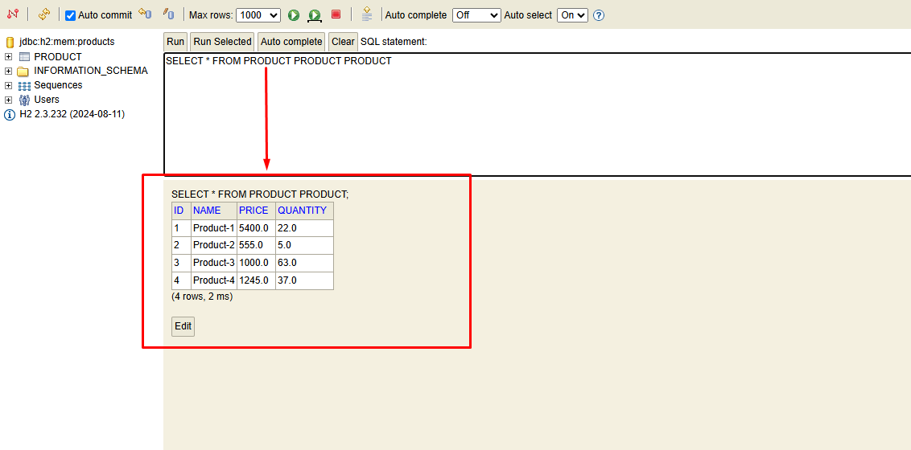
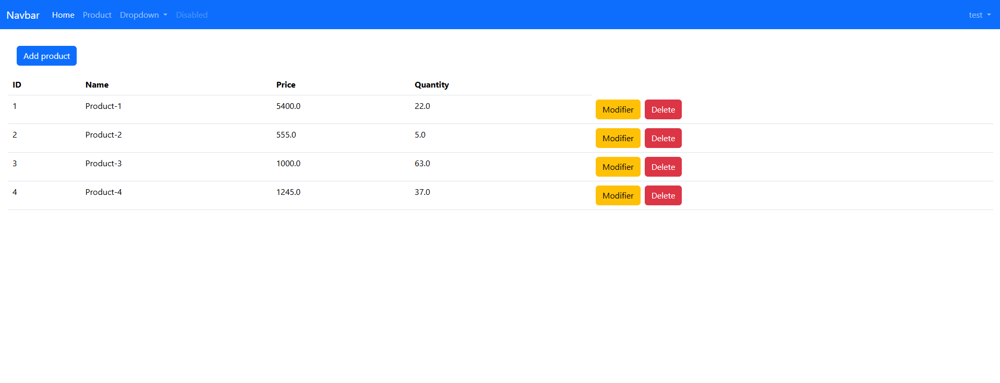
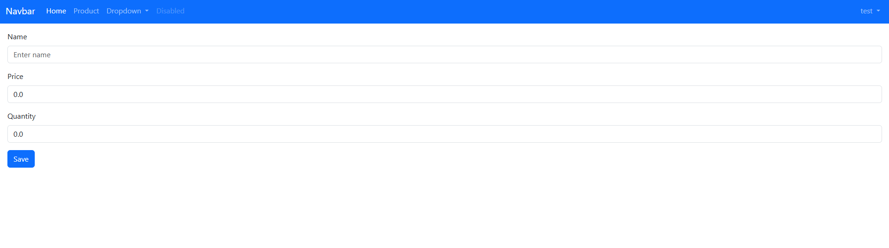
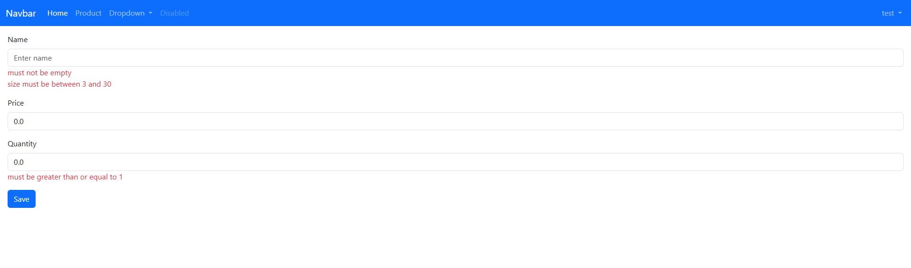
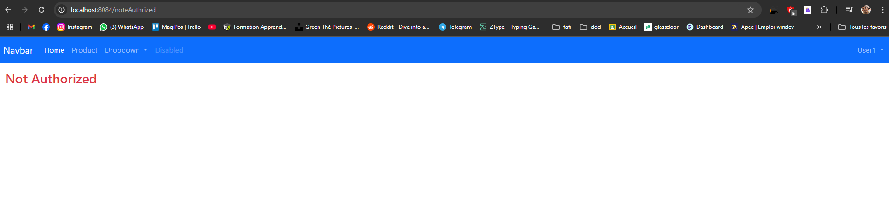
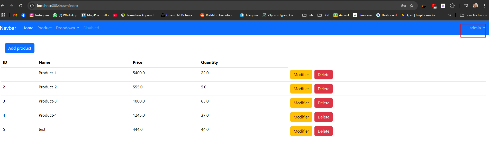
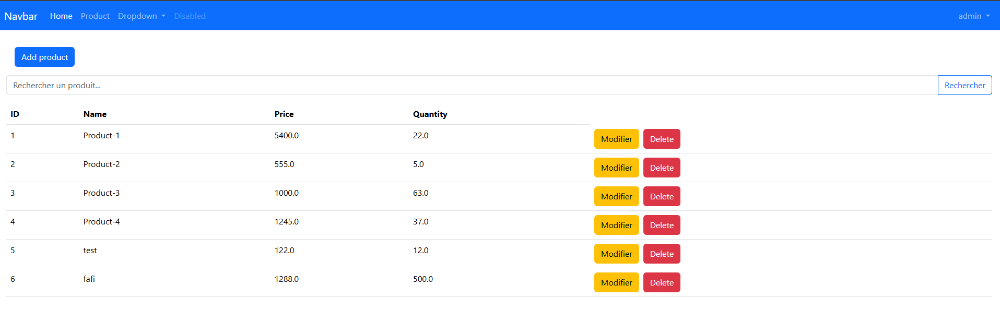
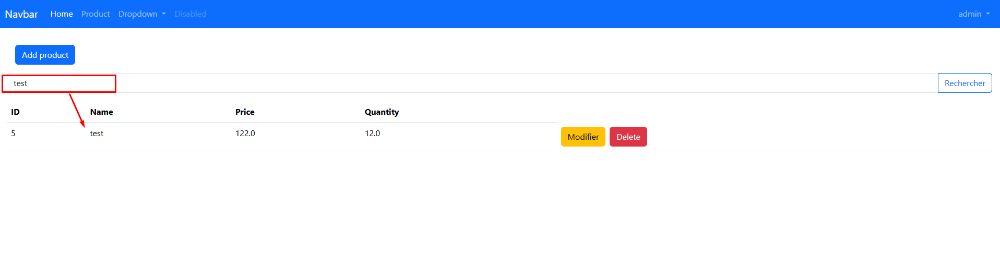

# Gestion des Produits – Application Web Spring Boot MVC

Ce projet est une application web de gestion des produits développée avec Spring Boot.
Il permet à un administrateur de gérer des produits (ajouter, modifier, supprimer), avec une interface utilisateur basée sur Thymeleaf et Bootstrap, et une sécurité assurée par Spring Security.

## 🎯 Objectifs pédagogiques

Ce projet a pour but de mettre en pratique les technologies suivantes :

<ul>
    <li>Spring Boot & Spring MVC</li>
    <li>Spring Data JPA avec Hibernate</li>
    <li>Spring Security</li>
    <li>Thymeleaf</li>
    <li>Bootstrap (via WebJars)</li>
    <li>Validation côté serveur</li>
    <li>Architecture MVC</li>
</ul>

## 🖼️ Captures d’écran

### -------------- Test la chouche DAO --------------

- Csl
  

- DATA BASE
  

###  -------------- Vues thymeleaf --------------

- List Products
  
- New product
  
- Validation Save Product
  
- Update Product
  
 ###   -------------- Sécuriser l'application avec Spring Security --------------

- page Note Authorization
  
- Authorization User
  
- Authorization admin
  
- Rechercher Des Produits
  
- 

    

    

